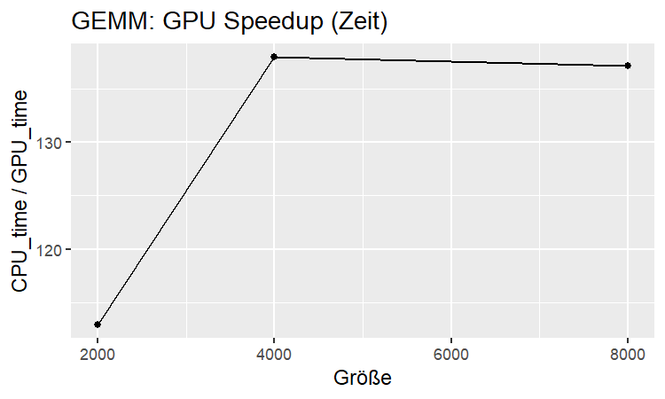
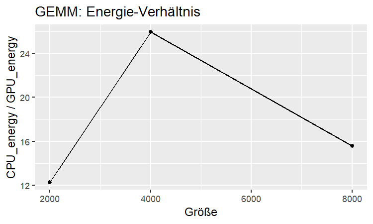
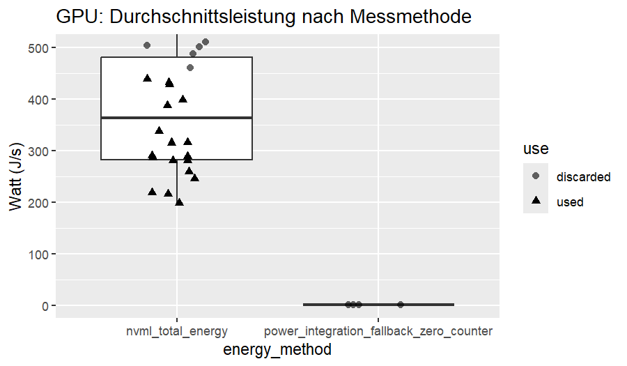

## QC-Entscheidungen (kurz)
 - GPU-Energie: nur `nvml_total_energy` mit Leistung 10–450 W
 - CPU-Energie: `rapl`/`rapl_pkg`

## Ergebnisse GEMM
```{r, echo=FALSE}
library(readr); library(dplyr); library(knitr)
appendix_tbl <- readr::read_csv("appendix_pilot_summary.csv", show_col_types = FALSE)
gemm <- appendix_tbl %>% dplyr::filter(workload=="GEMM") %>%
  dplyr::select(size, speedup_time, ratio_energy, ratio_edp)
knitr::kable(gemm, digits=2, caption="GEMM: Verhältnisse CPU/GPU")
```

### Abbildungen




## QC-Plot (Methodenvergleich)


## Reproduzierbarkeit
```{r, echo=FALSE}
print(sessionInfo())
```
